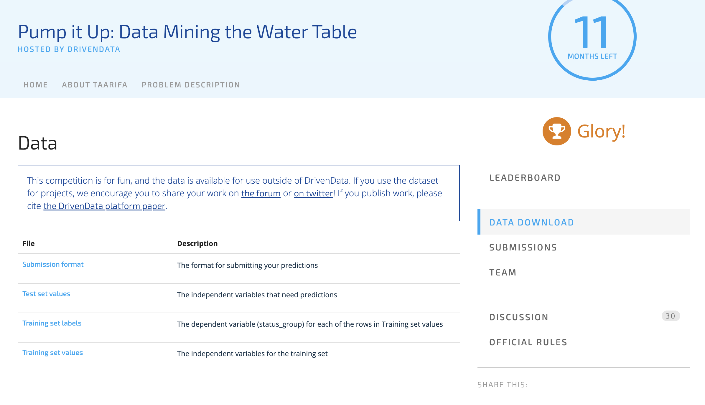

# Water Pumps

Water Pump functionaliy prediction. Based on the DrivenData challenge [Pump it Up: Data Mining the Water Table](https://www.drivendata.org/competitions/7/pump-it-up-data-mining-the-water-table/page/23/)

Built with ❤️ by [gerardrbentley](https://github.com/gerardrbentley)

## Project Walkthrough

Using data from [Taarifa](http://taarifa.org/) and the [Tanzanian Ministry of Water](http://maji.go.tz/), can we predict which pumps are functional, which need some repairs, and which don't work at all?

Predict one of these three classes based on a number of variables about what kind of pump is operating, when it was installed, and how it is managed.

A smart understanding of which waterpoints will fail can improve maintenance operations and ensure that clean, potable water is available to communities across Tanzania.

### Data Sources

- Training and test data from drivendata, along with submission format
  - Details in [problem description](https://www.drivendata.org/competitions/7/pump-it-up-data-mining-the-water-table/page/25/#features_list)



### Feature Exploration and Engineering

Much of this was guided by the DrivenData Competition forum, specifically this user's [EDA + Catboost example](https://towardsdatascience.com/pump-it-up-with-catboost-828bf9eaac68) (I haven't tried out all of his data processing steps... yet)

## What's this?

- `README.md`: This Document! To help you find your way around
- `streamlit_app.py`: The main app that gets run by [`streamlit`](https://docs.streamlit.io/)
- `requirements.txt`: Pins the version of packages needed
- `LICENSE`: Follows Streamlit's use of Apache 2.0 Open Source License
- `.gitignore`: Tells git to avoid comitting / scanning certain local-specific files
- `.streamlit/config.toml`: Customizes the behaviour of streamlit without specifying command line arguments (`streamlit config show`)
- `Makefile`: Provides useful commands for working on the project such as `run`, `lint`, `test`, and `test-e2e`
- `requirements.dev.txt`: Provides packages useful for development but not necessarily production deployment. Also includes all of `requirements.txt` via `-r`
- `pyproject.toml`: Provides a main configuration point for Python dev tools
- `.flake8`: Because `flake8` doesn't play nicely with `pyproject.toml` out of the box
- `.pre-commit-config.yml`: Provides safeguards for what you commit and push to your repo
- `tests/`: Folder for tests to be picked up by `pytest`

## Local Setup

Assumes working python installation and some command line knowledge ([install python with conda guide](https://tech.gerardbentley.com/python/beginner/2022/01/29/install-python.html)).

MacOS users may need to `brew install libomp` or `brew install cmake` (see [lightgbm](https://github.com/microsoft/LightGBM/tree/master/python-package)) or use conda

```sh
# External users: download Files
git clone git@github.com:gerardrbentley/water_pumps.git

# Go to correct directory
cd water_pumps

# Run the streamlit app (will install dependencies in a virtualenvironment in the folder venv)
make run
```

Open your browser to [http://localhost:8501/](http://localhost:8501/) if it doesn't open automatically.

### Local Development

The `Makefile` and development requirements provide some handy Python tools for writing better code.
See the `Makefile` for more detail

```sh
# Run black, isort, and flake8 on your codebase
make lint
# Run pytest with coverage report on all tests not marked with `@pytest.mark.e2e`
make test
# Run pytest on tests marked e2e (NOTE: e2e tests require `make run` to be running in a separate terminal)
make test-e2e
# Run pytest on tests marked e2e and replace visual baseline images
make test-e2e-baseline
# After running tests, display the coverage html report on localhost
make coverage
```

## Deploy

For the easiest experience, deploy to [Streamlit Cloud](https://streamlit.io/cloud)

For other options, see [Streamilt deployment wiki](https://discuss.streamlit.io/t/streamlit-deployment-guide-wiki/5099)

## Credits

This package was created with Cookiecutter and the `gerardrbentley/cookiecutter-streamlit` project template.

- Cookiecutter: [https://github.com/audreyr/cookiecutter](https://github.com/audreyr/cookiecutter)
- `gerardrbentley/cookiecutter-streamlit`: [https://github.com/gerardrbentley/cookiecutter-streamlit](https://github.com/gerardrbentley/cookiecutter-streamlit)

### DrivenData Platform

@misc{https://doi.org/10.48550/arxiv.1606.07781,
  doi = {10.48550/ARXIV.1606.07781},

  url = {https://arxiv.org/abs/1606.07781},

  author = {Bull, Peter and Slavitt, Isaac and Lipstein, Greg},

  keywords = {Human-Computer Interaction (cs.HC), Computers and Society (cs.CY), Social and Information Networks (cs.SI), Machine Learning (stat.ML), FOS: Computer and information sciences, FOS: Computer and information sciences},

  title = {Harnessing the Power of the Crowd to Increase Capacity for Data Science in the Social Sector},

  publisher = {arXiv},

  year = {2016},

  copyright = {Creative Commons Attribution 4.0 International}
}
